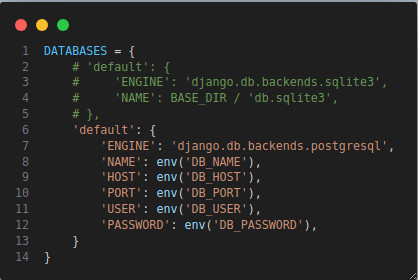
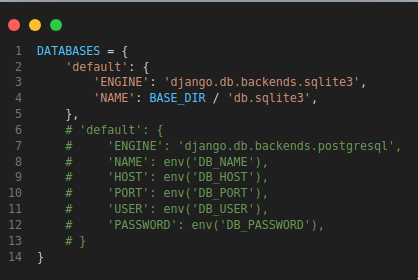
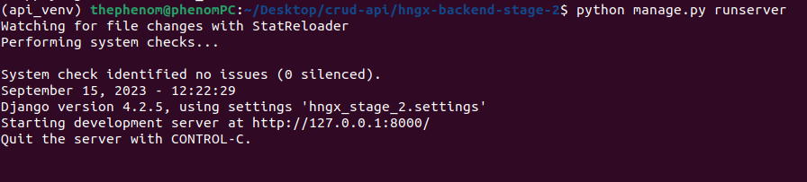

# hngx-backend-stage-2
#### A simple RESTful API with basic CRUD functionalites
---
###### Source Code: https://github.com/21stPhenom/hngx-backend-stage-2/
---

#### Requirements
- Python 3.11.1
- Django >= 4.2.5

---

#### Installation
> [!IMPORTANT]
> Make sure you have Python 3.11.1 installed before setting up the project locally.

1. Create a new directory for the project and clone the Github Repository
```bash
mkdir crud-api
cd crud-api

git clone https://github.com/21stPhenom/hngx-backend-stage-2
```
2. Create a virtual environment using `venv` and activate it.
```bash
python3.11 -m venv api_venv

# for linux users
source api_venv/bin/activate

# for windows users
api_venv\Scripts\activate
```
3. Move into the `hngx-backend-stage-2` directory and install the dependencies using `pip`.
```bash
pip install -r requirements.txt
```
4. Create a `.env` file in `hngx-backend-stage-2` and set your `DEBUG` and `SECRET_KEY` variables.
`hngx-backend-stage-2/.env`
```
DEBUG=True
SECRET_KEY=<YOUR_SECRET_KEY>
```
Replace `YOUR_SECRET_KEY` with your actual secret key.

5. Go to `hngx_stage_2/settings.py` and change the `DATABASES` setting use a local SQLite database.
Change this: 

    To this: 

6. Make migrations and migrate them to the database,
```bash
python manage.py makemigrations
python manage.py migrate
```

7. Run your local server and visit `http://127.0.0.1:8000/api/` to access your API.
```
python manage.py runserver
```


---

#### Usage
For more info on how to use the API, check out the [documentation](./DOCUMENTATION.md).